# SPFx List View Command Example

This example scenario demonstrates how to securely call an AAD secured remote service from an SPFx list view command set. It makes use of an [SPFx List View Extension](https://docs.microsoft.com/en-us/sharepoint/dev/spfx/extensions/get-started/building-simple-cmdset-with-dialog-api), [Azure Function Application](https://docs.microsoft.com/en-us/azure/azure-functions/), and [Azure Service Bus](https://docs.microsoft.com/en-us/azure/service-bus-messaging/) - along with properly configuring the authentication. All of the steps for setting up the demo solution can be found below.

## Application Flow


# Single-Tenant Setup

The example has a number of piece to setup and this guide will step through each. The steps are ordered as some information is needed in subsequent steps or some actions need happen ahead of others. Please follow the guide to ensure your solution is properly configured.

### Sections

<!-- no toc -->
- [Create Service Bus Queue](#create-service-bus-queue)
- [Create Azure App Function](#create-azure-functions-app)
- [Configure AAD App Settings](#configure-aad-app-settings)
- [Configure Local Settings](#configure-local-settings)
- [Deploy Azure Function App](#deploy-azure-function-app)
- [Update SPFx Solution](#update-spfx-solution)
- [Deploy Solution](#deploy-solution)

## Create Service Bus Queue

1. In [Azure Portal](https://portal.azure.com/) select "Create a resource"
2. Search for "service bus" and select the "Service Bus" option, then "Create"

    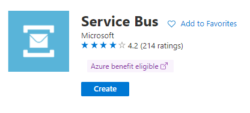

3. Select the subscription, resource group, namespace, and location then select "Review + Create"
4. Review your choices and select "Create"
5. Once provisioning is complete select "Go to resource" to load the resource page
6. On the left, select "Queues" under the "Entities" section
7. Select "+ Queue" at the top

    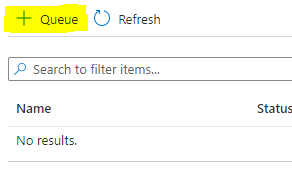

8. Provide a name for the new queue and note it for later. You may adjust other settings as needed but the remaining defaults are fine for this demo setup. Once ready select "Create"
9. Once created select the name of the new queue to open the details screen
10. On the left, select the "Shared access policies" under the "Settings" section
11. Select "+ Add" at the top
12. Give the policy a name and choose the "Send" and "Listen" options and select "Create"

    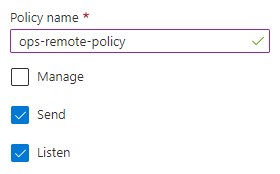

13.  Once created select the policy to expose the keys and connection strings. Copy the value of "Primary Connection String".

    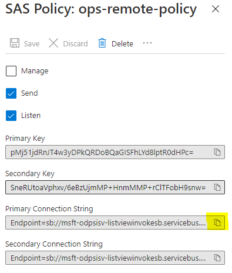

14. Paste it into a text editor and remove everything after and including the last ";". Note this edited connection string for later.

    _Endpoint=sb://{sb-name}.servicebus.windows.net/;SharedAccessKeyName={key-name};SharedAccessKey={shared-key};EntityPath={path}_

    becomes:

    _Endpoint=sb://{sb-name}.servicebus.windows.net/;SharedAccessKeyName={key-name};SharedAccessKey={shared-key}_


> From this section you should record:
> 
> - Queue Name (step 8)
> - Edited Queue Connection String (step 14)

[back to setup index](#sections)

## Create Azure Functions App

1. In [Azure Portal](https://portal.azure.com/) select "Create a resource" 
2. Search for "function app" and select the "Function App" option, then "Create"

    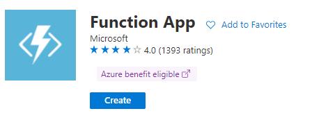

3. Select a subscription, resource group, name, and region. For the remaining options:
    - Publish: *Code*
    - Runtime stack: *Node.js*
    - Version: *14 LTS*
4. Select "Review + Create" as we will accept the remaining defaults. Ensure the options are correct and select "Create"
5. Once provisioning is complete select "Go to resource" to load the resource page
6. On the left, select "Authentication" under the "Settings" section
7. Select "Add identity provider"

    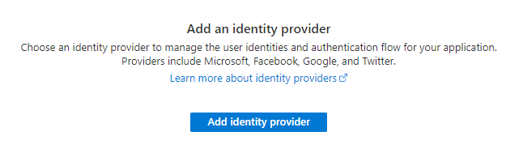

8. In the dropdown select "Microsoft". Accept the defaults as shown below and select "Next: permissions".

    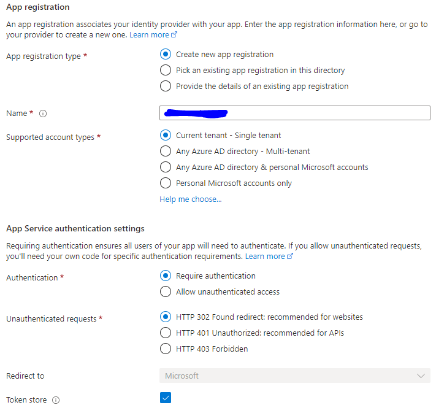

9. Select "+ Add permission" and choose "User.Read", "offline_access", "openid", and "Files.ReadWrite.All" then select "Add"

    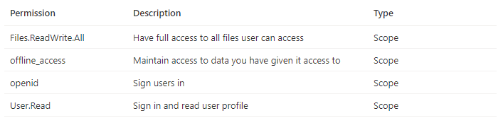

10. Once the identity provider is created, select the "edit" pencil icon and remove the "v2.0" from the end of the "Issuer URL" value, leaving the final "/" in place. The value should be "https://sts.windows.net/{your-tenant-id}/"

11. At this point, navigate to the url of your function you should be prompted to login and consent to the app permissions. If successful you will be land on a screen similar to below. The url will be of the form https://{app-name}.azurewebsites.net. **This step is required to establish the enterprise app entry used later for app permissions approval.**

    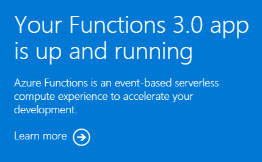

12. Navigate to "Configuration" under the "Settings" section of the function app. You need to add two keys whose values both come from the previous section on setting up the service bus. Once both are added select "Save" from at the top and "Continue" when prompted to update the app with the new settings.
    
    - *ServiceBusConnection* = The edited service bus connection
    - *ServiceBusQueueName* = The name of the queue
    - *MICROSOFT_PROVIDER_AUTHENTICATION_APPID* = The App ID of the AAD app associated with the function

13. Navigate to "CORS" under "API". Enter a "*" for allowed origins and select "Save" at the top. Depending on your needs you can use this setting to limit what SP sites can call your API. The value of "*" allows all domains to call the service, acceptable for the demo.

> From this section you should record:
> 
> - Azure Function App Url (step 11)

[back to setup index](#sections)

## Configure AAD App Settings

1. In the settings of the function app created in the previous section, select "Authentication" under the "Settings" section
2. Copy the "Display name" and "Application (client) ID" for later
3. Navigate to "Expose an API" under the "Manage" section
4. Update the Application ID URI and set the value to match the URL of the Azure function and select save. The value will be https://{function-app-name}.azurewebsites.net
5. Navigate to "API Permissions" under the "Manage" section
6. Select the "Grant Admin consent" option to consent to all the permissions for the tenant if not already consented.

> From this section you should record:
> 
> - Azure Application Name (step 2)
> - Azure Application ID (step 2)

[back to setup index](#sections)

## Configure Local Settings

To ensure smooth publishing of the application you need to create a "local.settings.json" file within the "azure-functions" folder.

```json
{
  "IsEncrypted": false,
  "Values": {
    "FUNCTIONS_WORKER_RUNTIME": "node",
    "AzureWebJobsStorage": "UseDevelopmentStorage=true"
}
```

[back to setup index](#sections)

## Deploy Azure Function App

This section uses the [Azure CLI](https://docs.microsoft.com/en-us/cli/azure/) to conduct the deployment. There are many ways to deploy apps to Azure and you should use the methods most comfortable to you.

> You also need to install the azure function tools v3 using `npm i -g azure-functions-core-tools@3 --unsafe-perm true`

1. Open a command window and navigate to the project folder "azure-function"
2. Enter `az login` to login to the Azure instance
3. Run `npm run build`
4. Run `func azure functionapp publish {app-name}`
5. Within the Azure Portal, ensure the app is running and there are no deployment errors

[back to setup index](#sections)

## Update SPFx Solution

1. Open the solution in the "spfx-list-view-command" folder of the "list-view-service-integration" sample
2. Edit the "./config/package-solution.json" file to include the "webApiPermissionRequests" section. Replace {app-name} with the name of your application from the previous section.

        "webApiPermissionRequests": [
            {
                "resource": "{app-name}",
                "scope": "user_impersonation"
            },
            {
                "resource": "Windows Azure Active Directory",
                "scope": "User.Read"
            }
        ],

3. Update "./sharepoint/assets/ClientSideInstance.xml" and "./sharepoint/assets/elements.xml" changing the {app-name} and {app-id} values to those of your function app and backing AAD application.
4. Update "./config/serve.json" changing the value of pageUrl to point to a document library in your development tenant, also update the properties for both serve configurations to set the apiAbsUrl and appId values.
5. Finally, update "./src/extensions/contoso/ContosoCommandSet.manifest.json" updating the value "https://{app-name}.azurewebsites.net/api/IconServer" with your app name.

[back to setup index](#sections)

## Deploy Solution

Follow the [docs to deploy the solution](https://docs.microsoft.com/en-us/sharepoint/dev/spfx/extensions/get-started/building-simple-cmdset-with-dialog-api#deploy-the-extension-to-sharepoint-online) and approve the permissions in the SharePoint admin site for the API.

At this point the solution is configured for testing in your local environment.

[back to setup index](#sections)

# Multi-Tenant Setup

### Sections2

<!-- no toc -->
- [Update AAD Application](#update-aad-application)
- [Update Function App](#update-function-app)
- [Consent to Application in new Tenant](#consent-to-application-in-new-tenant)
- [Deploy App to New Tenant](#consent-to-application-in-new-tenant)
- [Next Steps](#next-steps)
- [Related Links](#related-links)

## Update AAD Application

1. In [Azure Portal](https://portal.azure.com/) locate the function application you created. Select "Authentication" under the "Settings" heading.
2. Select the link to the associated Azure Active Directory Application registration

    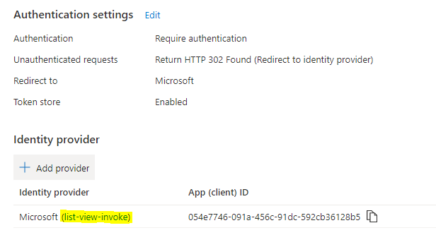

3. Select "Expose an API" under the "Manage" heading. Update the App ID URI to a value including your tenant host name. Previously we used URL of the azure function application, which was OK for single tenant, but multiple tenants must have a way to uniquely identify your application. So a value "https://myfunc.azurewebsites.net" will become "https://{tenant}.onmicrosoft.com/myfunc".
4. Select "Authentication" under the "Manage" heading. Update the Supported account types settings to Multitenant and select "Save" at the top. 

    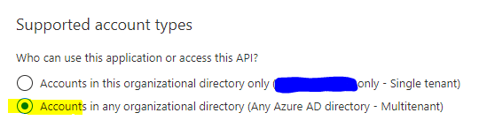

## Update Function App

1. In [Azure Portal](https://portal.azure.com/) locate the function application you created. Select "Authentication" under the "Settings" heading.
2. Select the pencil icon to edit the Identity Provider.
3. Clear the issuer URL entry so it is blank and select "Save"

## Consent to Application in new Tenant

1. Open the URL to your function app in a window authenticated to the target tenant and follow the authentication and consent flow. If you would like you may consent on behalf of your organization. This step is required to ensure our multi-tenant settings are working and to create the Enterprise Applicaiton entry in the new tenant so it can be found when approving the API permissions.

## Deploy App to New Tenant

Follow the [docs to deploy the solution](https://docs.microsoft.com/en-us/sharepoint/dev/spfx/extensions/get-started/building-simple-cmdset-with-dialog-api#deploy-the-extension-to-sharepoint-online) and approve the permissions in the SharePoint admin site for the API.

You will need to approve the API permissions in the SharePoint admin center for each tenant to which you deploy the solution.

[back to setup index](#sections2)

## Additional Information

This section contains links to additional resources related to the technologies used to build this example.

### SPFx app

- [SharePoint Framework Overview](https://aka.ms/spfx)
- [Build your first ListView Command Set extension](https://docs.microsoft.com/en-us/sharepoint/dev/spfx/extensions/get-started/building-simple-cmdset-with-dialog-api)
- [Connect to Azure AD-secured APIs in SharePoint Framework solutions](https://docs.microsoft.com/en-us/sharepoint/dev/spfx/use-aadhttpclient)
- [Deploy SPFx solutions](https://docs.microsoft.com/en-us/sharepoint/dev/spfx/extensions/get-started/building-simple-cmdset-with-dialog-api#deploy-the-extension-to-sharepoint-online)
- [Submit to SPFx Solution to Store](https://docs.microsoft.com/en-us/sharepoint/dev/spfx/publish-to-marketplace-overview)
- [Consume multi-tenant enterprise APIs secured with Azure AD in SharePoint Framework](https://docs.microsoft.com/en-us/sharepoint/dev/spfx/use-aadhttpclient-enterpriseapi-multitenant)

### Azure Functions

- [Overview](https://docs.microsoft.com/en-us/azure/azure-functions/)
- [Tools](https://github.com/Azure/azure-functions-core-tools)
- [Http Triggered Functions](https://docs.microsoft.com/en-us/azure/azure-functions/functions-bindings-http-webhook)
- [Create a function app for serverless code execution](https://docs.microsoft.com/en-us/azure/azure-functions/scripts/functions-cli-create-serverless)
- [Securing Azure Functions](https://docs.microsoft.com/en-us/azure/azure-functions/security-concepts)
- [Token Store](https://docs.microsoft.com/en-us/azure/app-service/overview-authentication-authorization#token-store)
- [Configure how end-users consent to applications](https://docs.microsoft.com/en-us/azure/active-directory/manage-apps/configure-user-consent?tabs=azure-portal)
- [Configure your App Service or Azure Functions app to use Azure AD login](https://docs.microsoft.com/en-us/azure/app-service/configure-authentication-provider-aad)
- [Azure Functions JavaScript developer guide](https://docs.microsoft.com/en-us/azure/azure-functions/functions-reference-node?tabs=v2)
- [Call API securely from browser code](https://docs.microsoft.com/en-us/azure/app-service/tutorial-auth-aad?pivots=platform-linux#call-api-securely-from-browser-code)
- [Microsoft identity platform and OAuth 2.0 On-Behalf-Of flow](https://docs.microsoft.com/en-us/azure/active-directory/develop/v2-oauth2-on-behalf-of-flow)

### Service Bus

- [Overview](https://docs.microsoft.com/en-us/azure/service-bus-messaging/service-bus-quickstart-portal)
- [Send messages to and receive messages from Azure Service Bus queues (JavaScript)](https://docs.microsoft.com/en-us/azure/service-bus-messaging/service-bus-nodejs-how-to-use-queues)


