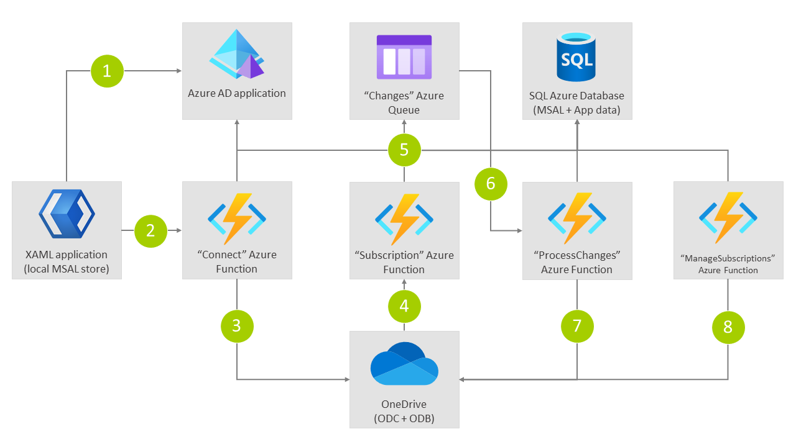

# OneDrive files integration sample

## Overview

This sample application shows how an application (desktop application) can connect with either OneDrive for Business (ODB) or the OneDrive consumer (ODC) service. Once connected a Microsoft Graph subscription is configured which calls into the application's web hook service. The web hook service will queue the change, allowing it to be picked up by a background service which processes the change notification by performing a delta query and getting the actual changes that happened on the user's OneDrive.

## Technology

This sample uses .NET Core 3.1 for all projects:

- FilesApplication: XAML Windows desktop application allowing the user to connect to OneDrive and upload files
- FilesFunction: Azure v3 functions project hosting the connect, web hook, process changes and manage subscriptions Azure functions
- IntegratedTokenCache: Class library shared across all projects, providing the logic needed to persist MSAL cache and application data

For authentication the sample uses Microsoft.Identity.Web and Microsoft.Identity.Client (MSAL), SQL (Azure) is used for centrally storing the distributed token cache and application data.

## Scenario

The following schema shows the scenario realized by this sample:

1. Via a XAML .NET desktop application the user signs in to Azure AD (app with user.read and files.read.all permission) using their MSA (for ODC) or Microsoft 365 account (for ODB). MSAL is used with a custom cache provider that caches the access token and refresh token (information returned via MSAL) locally on the user’s machine, encrypted via the user’s account
2. As part of the sign-in a “connect” Azure function is called, this is using an on-behalf-of auth flow. In here the SQL distributed MSAL cache provider is used, resulting in the user’s (refresh) token being stored in the SQL database
3. The “connect” Azure function sets up a subscription on the user’s ODB/ODC using the “Subscription” Azure function as the web hook service. The .NET Graph SDK is used for this, being called “as the user” since we’re using an on-behalf-of flow. In this step we also call the delta api with a “latest” token and store the resulting change token in the SQL database
4. A file is uploaded to the user’s ODB/ODC and the subscription calls the “Subscription” Azure function
5. The “Subscription” Azure function stores the incoming change notifications as messages in an Azure storage queue. This is needed to provided a timely (within 30 seconds) response to the process calling the “Subscription” Azure function
6. The “ProcessChanges” Azure function is invoked for each message arriving in the queue. As this function needs to act as the user we use the earlier stored MSAL (refresh) token data from the SQL database…MSAL will get us an access token based up on the cached refresh token
7. The “ProcessChanges” Azure function calls the delta API (using the .NET Graph SDK) to get a list of changes. To only retrieve the changes since last invocation it reads and update the last used change token in the SQL Azure database. The retrieved changes are then processed (e.g. pulling down the needed files from the user’s ODB/ODC and processing them)
8. The "ManageSubscriptions" function is fired via a timer and will renew the subscriptions by acting as the respective users that created these subscriptions

## How to run this sample

### Pre-requisites

This application was developed using [Visual Studio 2019](https://visualstudio.microsoft.com/) using .NET Core 3.1. To support local debugging it's recommended to use [ngrok](https://ngrok.com/) as tunneling application that can route subscription calls to localhost. Using [SQL Server Management Studio](https://docs.microsoft.com/sql/ssms/download-sql-server-management-studio-ssms?view=sql-server-ver15) is recommended for configuring the needed SQL database.

### Registering the Azure AD application

This sample contains multiple projects but they all use the same Azure AD application. As a first step you'll need to:

- Sign in to the [Azure portal](https://portal.azure.com/).
- If your account is present in more than one Azure AD tenant, select your profile at the top right corner in the menu on top of the page, and then switch directory to change your portal session to the desired Azure AD tenant.

Next register the OneDriveFilesDemo application:

1. Navigate to the Microsoft identity platform for developers [App registrations](https://go.microsoft.com/fwlink/?linkid=2083908) page.
1. Select **New registration**.
1. In the **Register an application page** that appears, enter your application's registration information:
   - In the **Name** section, enter a meaningful application name that will be displayed to users of the app, for example `OneDriveFilesDemo`.
   - Under **Supported account types**, select **Accounts in any organizational directory and personal Microsoft accounts (e.g. Skype, Xbox, Outlook.com)**.
   - In the **Redirect URI (optional)** section, select **Public client/native (mobile & desktop)** in the combo-box and enter the following redirect URI: `https://localhost`.
1. Select **Register** to create the application.
1. In the app's registration screen, find and note the **Application (client) ID**. You use this value in your app's configuration file(s) later in your code.
1. In the **Authentication** section:
    - Choose **Mobile and desktop applications**
    - Under **Redirect URIs** select the option, `https://login.microsoftonline.com/common/oauth2/nativeclient`
    - Select **Save**
1. In the app's registration screen, click on the **Certificates & secrets** blade in the left to open the page where we can generate secrets and upload certificates.
1. In the **Client secrets** section, click on **New client secret**:
   - Type a key description (for instance `app secret`),
   - Select one of the available key durations (**In 1 year**, **In 2 years**, or **Never Expires**) as per your security posture.
   - The generated key value will be displayed when you click the **Add** button. Copy the generated value for use in the steps later.
   - You'll need this key later in your code's configuration files. This key value will not be displayed again, and is not retrievable by any other means, so make sure to note it from the Azure portal before navigating to any other screen or blade.
1. In the app's registration screen, select the **Expose an API** blade to the left to open the page where you can declare the parameters to expose this app as an Api for which client applications can obtain [access tokens](https://docs.microsoft.com/azure/active-directory/develop/access-tokens) for. The first thing that we need to do is to declare the unique [resource](https://docs.microsoft.com/azure/active-directory/develop/v2-oauth2-auth-code-flow) URI that the clients will be using to obtain access tokens for this Api. To declare an resource URI, follow the following steps:
   - Click `Set` next to the **Application ID URI** to generate a URI that is unique for this app.
   - For this sample, accept the proposed Application ID URI (api://{clientId}) by selecting **Save**.
1. All Apis have to publish a minimum of one [scope](https://docs.microsoft.com/azure/active-directory/develop/v2-oauth2-auth-code-flow#request-an-authorization-code) for the client's to obtain an access token successfully. To publish a scope, follow the following steps:
   - Select **Add a scope** button open the **Add a scope** screen and Enter the values as indicated below:
        - For **Scope name**, use `access_as_user`.
        - Select **Admins and users** options for **Who can consent?**
        - For **Admin consent display name** type `Access OneDriveFilesDemo`
        - For **Admin consent description** type `Allows the app to access OneDriveFilesDemo as the signed-in user.`
        - For **User consent display name** type `Access OneDriveFilesDemo`
        - For **User consent description** type `Allow the application to access OneDriveFilesDemo on your behalf.`
        - Keep **State** as **Enabled**
        - Click on the **Add scope** button on the bottom to save this scope.
1. In the app's registration screen, click on the **API permissions** blade in the left to open the page where we add access to the APIs that your application needs.
   - Click the **Add a permission** button and then,
   - Ensure that the **Microsoft APIs** tab is selected.
   - In the *Commonly used Microsoft APIs* section, click on **Microsoft Graph**
   - In the **Delegated permissions** section, select the **User.Read** in the list. Use the search box if necessary.
   - In the **Delegated permissions** section, select the **Files.ReadWrite.All** in the list. Use the search box if necessary.
   - Click on the **Add permissions** button at the bottom.
   - Click the **Add a permission** button and then:
   - Ensure that the **My APIs** tab is selected.
   - In the list of APIs, select the API `OneDriveFilesDemo`.
   - In the **Delegated permissions** section, select the **Access OneDriveFilesDemo** in the list. Use the search box if necessary.
   - Click on the **Add permissions** button at the bottom.

### Configuring (Azure) SQL server

The sample needs a SQL database to store the MSAL token cache and application data. Create a database with name `IntegratedTokenCache` using either the SQL Azure management pages or [SQL Server Management Studio](https://docs.microsoft.com/sql/ssms/download-sql-server-management-studio-ssms?view=sql-server-ver15) and then run the `IntegratedTokenCache.sql` script to add the needed tables to the database.

### Updating the configuration files

Open the project in your IDE (like Visual Studio or Visual Studio Code) to configure the code.

>In the steps below, "ClientID" is the same as "Application ID" or "AppId".

1. Rename `App.sample.config` to `App.config` in the **`FilesApplication` project**
2. Find the app key `ida:ClientId` and replace the existing value with the application ID (clientId) of the `OneDriveFilesDemo` copied from the Azure portal.
3. Find the app key `files:ServiceScope` and replace the value with the `api://{client_id}` scope.
4. Rename `local.settings.sample.json` to `local.settings.json` in the **`FilesFunction` project**
5. Find the app key `AzureAd:ClientId` and replace the existing value with the application ID (clientId) of the `OneDriveFilesDemo` copied from the Azure portal.
6. Find the app key `AzureAd:ClientSecret` and replace the existing value with the the key you saved during the creation of the `OneDriveFilesDemo`, in the Azure portal.
7. Find the app key `ConnectionStrings:DefaultConnection` and replace the existing value with the connection string to your SQL database. For SQL Azure this will similar to `Server=tcp:<server>.database.windows.net,1433;Initial Catalog=IntegratedTokenCache;Persist Security Info=False;User ID=<user>;Password=<pwd>;MultipleActiveResultSets=False;Encrypt=True;TrustServerCertificate=False;Connection Timeout=30;`
8. Find the app key `Files:SubscriptionService` and replace the existing value with the ngrok host you're using (e.g. `https://4223f7eca51f.ngrok.io`). You first need to launch ngrok before you know what host value will be used. To launch ngrok use `ngrok http 7071 --host-header=rewrite`

### Starting the sample in Visual Studio

Both the Azure function project as the XAML client application need to run at the same time. This can be configured in Visual Studio:

1. Right click the solution in Visual Studio and choose **Properties**
2. Configure **Multiple startup projects** and then ensure the action **Start** is set for both the `FilesApplication` as `FilesFunction` projects

To now start the sample press F5.

## Learn more

This sample was inspired by other samples, documentation, blogs are more. Here are some of the key resources used while building the sample:

- Identity advocates for Microsoft's Identity Division: https://dev.to/425show
- Azure AD code sample overview: https://docs.microsoft.com/azure/active-directory/develop/sample-v2-code#multi-tenant-saas-applications
- Using Microsoft Graph with personal accounts: https://docs.microsoft.com/samples/azure-samples/active-directory-dotnet-native-aspnetcore-v2/3-web-api-call-microsoft-graph-for-personal-accounts/
- Custom token cache handling using MSAL: https://github.com/Azure-Samples/ms-identity-dotnet-advanced-token-cache/tree/master/1-Integrated-Cache/1-2-WebAPI-BgWorker
- Upload files via Microsoft Graph SDK: https://docs.microsoft.com/graph/sdks/large-file-upload?tabs=csharp
- Building a Microsoft Graph subscription service using Azure Functions: https://docs.microsoft.com/graph/tutorials/azure-functions?tutorial-step=4
- Track changes on files via Graph Delta queries: https://docs.microsoft.com/graph/api/driveitem-delta?view=graph-rest-1.0&tabs=csharp