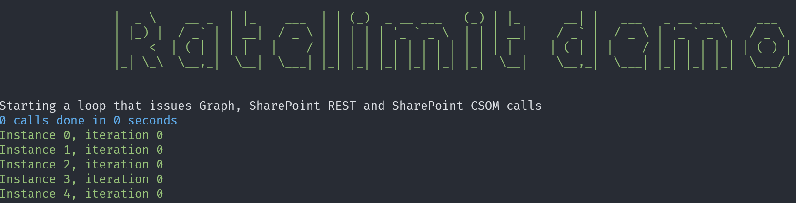
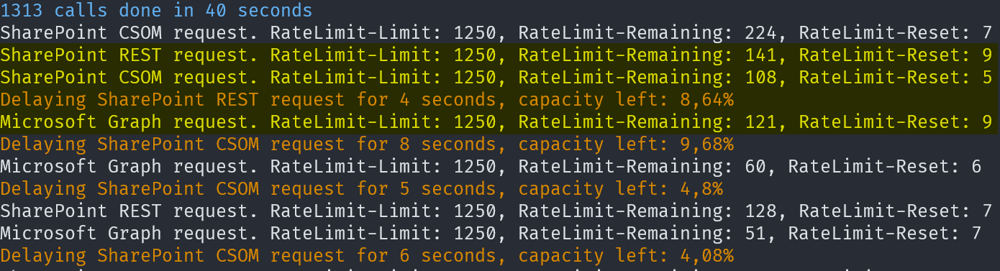
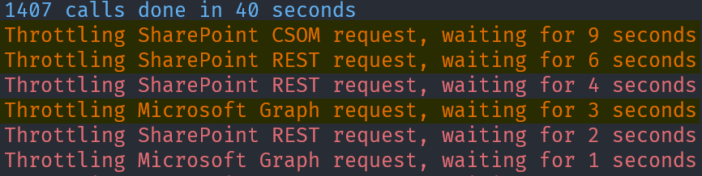
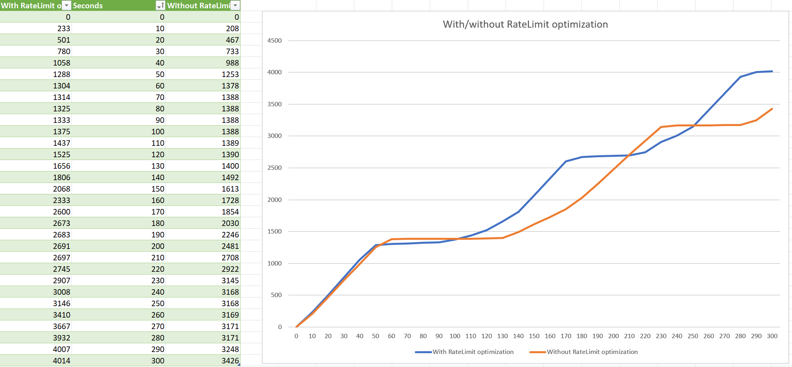

# Using RateLimit headers to optimize the throttling behavior

[SharePoint Online uses throttling](https://learn.microsoft.com/en-us/sharepoint/dev/general-development/how-to-avoid-getting-throttled-or-blocked-in-sharepoint-online) to maintain optimal performance and reliability of the SharePoint Online service. Throttling limits the number of API calls or operations within a time window to prevent overuse of resources. When your application gets throttled SharePoint Online returns a HTTP status code 429 ("Too many requests") or 503 ("Server Too Busy") and the requests will fail. In both cases, a Retry-After header is included in the response indicating how long the calling application should wait before retrying or making a new request.

In addition to the Retry-After header in the response of throttled requests, SharePoint Online also returns the [IETF RateLimit headers](https://github.com/ietf-wg-httpapi/ratelimit-headers) for selected limits in certain conditions to help applications manage rate limiting. We recommend applications to take advantage of these headers to avoid getting throttled and therefore achieve a better overall throughput for your application.

> **Note:**
>
> - These headers are currently in beta and subject to change. At the time when the headers were adopted, the IETF specification was in draft. The current implementation is based on the draft-03 of the IETF specification. There is the potential for changes when the specification is final, and we will adapt to those changes in the future.
> - RateLimit headers only are returned when using an Azure AD application for authentication.

## Preparing the RateLimit header demo application

Before you can run the demo you need to first configure it by setting up an Azure AD application followed by plugging in the needed Azure AD information. Both steps are explained in the next chapters.

### Step 1: Creating an Azure AD application using the Azure AD Portal

Follow below steps to create and configure your Azure AD application.

1. Navigate to [Azure AD Portal](https://aad.portal.azure.com/) and click on **Azure Active Directory** from the left navigation
2. Click on **Add** in the toolbar and choose **App registration**, this will open up the **Register an application** page
3. Provide a **Name** for your Azure AD application (e.g. RateLimitDemo)
4. Select **Public client/native (mobile & desktop)** and enter **http://localhost** as redirect URI
5. Click on **Register** and the Azure AD application gets created and opened
6. Choose **API permissions** from the left navigation and add the needed application permissions:
   1. Add the **Microsoft Graph** application permission **Sites.Read.All**
   2. Add the **SharePoint** application permission **Sites.Read.All**
7. Click on **Grant admin consent for...** to consent the added permissions
8. Go to **Certificates & secrets**, click on **Certificates** and **Upload certificate**, pick the .cer file of your certificate and add it.

> **Note:**
>
> If you don't have a certificate available then you can use [Windows PowerShell to create one](https://docs.microsoft.com/en-us/azure/active-directory/develop/howto-create-self-signed-certificate).

### Step 2: Plugging in the needed information

Open the `Demo.cs` file from the sample and plug in the needed information as shown below. The demo allows you to provide a certificate via a PFX file or use a locally stored certificate.

```csharp
// Set the client ID of your Azure AD application (GUID)
private static string ClientId = "c545f9ce-1c11-440b-812b-0b35217d9e83";

// Set the tenant ID of you Azure AD tenant (GUID, load https://aad.portal.azure.com, and click on "Azure Active Directory")
private static string TenantId = "d8623c9e-30c7-473a-83bc-d907df44a26e";

// Provide the host name of SharePoint Online tenant (e.g. contoso.sharepoint.com)
private static string TenantName = "contoso.sharepoint.com";

// Provide path to locally stored certificate, e.g. My|CurrentUser|b133d1cb4d19ce539986c7ac67de005481084c84
// for a certificate stored in the local store (certmgr.msc), Personal node (=My) using certificate thumbprint b133...
// You can get the thumbprint by looking up your certificate via certmgr, opening it to the Details tab
// and scrolling down to the Thumbprint field
private static string CertificatePath = "My|CurrentUser|b133d1cb4d19ce539986c7ac67de005481084c84";

// Provide path to PFX file containing the cert to use
private static string CertificatePFXPath = "";

// Provide password used to protect the PFX file
private static string CertificatePFXPassword = "";
```

## Executing the RateLimit header demo application

When you're using Visual Studio press F5 to launch the demo, if you're the console navigate to the folder containing the `RateLimitDemo.sln` file, type `dotnet run`  and press enter. The application will start to run, launch 5 parallel threads that each start issuing a Microsoft Graph, SharePoint REST and SharePoint CSOM in a loop.



When the application has consumed 80% of it's resource unit quota SharePoint will start to send RateLimit headers, which are shown by the application. Once the application detects there's only 10% resource units left it will automatically slow down to avoid getting throttled.



You can disable the RateLimit header processing in this sample by updating the `Program.cs` file like this:

```csharp
var demo = new Demo();
// Specify the number of parallel threads and whether RateLimit headers are processed
await demo.InitializeAndRunAsync(5, false);
```

Running the sample again will initially look the same, but when you're crossing the allocated resource unit quota the application will be throttled. When throttled, the application will retry the throttled request after waiting for the time defined by the Retry-After header:



## Benefits of using the RateLimit headers

A typical pattern we see with applications getting throttled is the following: the application starts full speed, gets throttled and as such is halted for some time and then again ramps up...until it's halted again due to throttling. This cycle of ramping up and halting is not very efficient and results in a lesser throughput compared to using the RateLimit headers and avoid getting throttled. Using RateLimit headers will slow down your application but you'll not see the application being halted. Furthermore when a request is retried due to throttling each retry itself counts towards the defined resource unit quota, resulting in less successful requests for a given resource unit quota.

> **Important:**
>
> The highest application throughput is achieved by "just" staying within the application's resource unit quota, so by "just" not getting throttled.

Below graph show the request throughput for this demo application, clearly showing the difference between using RateLimit headers and not using them. The blue line shows the number of requests for when RateLimit headers are used, it's relatively smooth and there are no application halts. The orange line shows the number of requests when not using RateLimit headers, you'll see more horizontal parts indicating application halting and after 5 minutes there's considerately less throughput compared to when using RateLimit headers.



## Explaining the key pieces of code

The key classes to understand are the `ThrottlingHandler` and the `RateLimiter` classes. The `ThrottlingHandler` class is [an HTTP DelegatingHandler which can be plugged into the HTTP pipeline](https://learn.microsoft.com/en-us/aspnet/web-api/overview/advanced/httpclient-message-handlers), each issued Microsoft Graph, SharePoint REST or SharePoint CSOM request is passing via the handlers `SendAsync` method override. In that method you'll see the request issued in a while loop and if needed (checking via the `ShouldRetry` method) the request is issued again.

```csharp
protected override async Task<HttpResponseMessage> SendAsync(HttpRequestMessage request, CancellationToken cancellationToken)
{
    int retryCount = 0;

    while (true)
    {
        // Throw an exception if we've requested to cancel the operation
        cancellationToken.ThrowIfCancellationRequested();

        //...

        // Issue the request
        HttpResponseMessage response = await base.SendAsync(request, cancellationToken);

        // If the request does not require a retry then we're done
        if (!ShouldRetry(response.StatusCode))
        {
            return response;
        }

        // Prep request for retry

        // Increase retryCount
        retryCount++;

        // Delay time based upon Retry-After header
        await delay;
    }
}
```

The RateLimit header handling is implemented in the `RateLimiter` class which is consumed from the `ThrottlingHandler` `SendAsync` method by calling the `UpdateWindow` method after each done request and calling `WaitAsync` before each request.

```csharp
// Check if we need to delay this request due to rate limiting
if (rateLimiter != null)
{
    await rateLimiter.WaitAsync(apiType, cancellationToken);
}

// Issue the request
HttpResponseMessage response = await base.SendAsync(request, cancellationToken);

// Inspect the response headers for RateLimit headers
rateLimiter?.UpdateWindow(response, apiType);

```

The `UpdateWindow` method will inspect the HTTP Response for RateLimit headers and if present stores the RateLimit header values and when the current window will be reset.

```csharp
if (response.Headers.TryGetValues(RATELIMIT_LIMIT, out IEnumerable<string> limitValues))
{
    string rateString = limitValues.First();
    _ = int.TryParse(rateString, out rateLimit);
}

if (response.Headers.TryGetValues(RATELIMIT_REMAINING, out IEnumerable<string> remainingValues))
{
    string rateString = remainingValues.First();
    _ = int.TryParse(rateString, out rateRemaining);
}

if (response.Headers.TryGetValues(RATELIMIT_RESET, out IEnumerable<string> resetValues))
{
    string rateString = resetValues.First();
    _ = int.TryParse(rateString, out rateReset);
}

readerWriterLock.EnterWriteLock();
try
{
    _ = Interlocked.Exchange(ref limit, rateLimit);
    _ = Interlocked.Exchange(ref remaining, rateRemaining);
    _ = Interlocked.Exchange(ref reset, rateReset);

    if (rateReset > -1)
    {
        // Track when the current window get's reset
        _ = Interlocked.Exchange(ref nextReset, DateTime.UtcNow.Ticks + TimeSpan.FromSeconds(rateReset).Ticks);
    }
}
finally
{
    readerWriterLock.ExitWriteLock();
}
```

In the `WaitAsync` method the percentage of resource units left in the current window is calculated. If below a threshold (defaults at 10% in this sample) the request execution is delayed until the current window is reset.

```csharp
long delayInTicks = 0;
float capacityLeft = 0;
readerWriterLock.EnterReadLock();
try
{
    // Remaining = 0 means the request is throttled and there's a retry-after header that will be used
    if (limit > 0 && remaining > 0)
    {
        // Calculate percentage requests left in the current window
        capacityLeft = (float)Math.Round((float)remaining / limit * 100, 2);

        // If getting below the minimum required capacity then lets wait until the current window is reset
        if (capacityLeft <= MinimumCapacityLeft)
        {
            delayInTicks = nextReset - DateTime.UtcNow.Ticks;
        }
    }
}
finally
{
    readerWriterLock.ExitReadLock();
}

if (delayInTicks > 0)
{
    await Task.Delay(new TimeSpan(delayInTicks), cancellationToken).ConfigureAwait(false);
}
```
